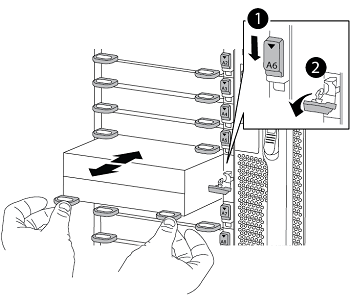

= 更換 AFF A700 或 FAS9000 控制器和 NVRAM 模組
:hardbreaks:
:allow-uri-read: 
:nofooter: 
:icons: font
:linkattrs: 
:imagesdir: ./media/

[role="lead"]
在此階段、node1已關閉、所有資料均由node2提供服務。由於節點1和節點2位於同一個機箱中、並由相同的電源供應器組供電、因此請勿關閉機箱電源。您必須小心、只移除節點1控制器模組和節點1 NVRAM模組。通常、節點1是位於機箱左側的控制器A、當您從系統背面查看控制器時。控制器標籤位於控制器模組正上方的機箱上。

.開始之前
如果您尚未接地、請正確接地。

== 移除AFF 「功能不整」或「FAS9000」控制器模組

從 node1 中分離並刪除 AFF A700 或 FAS9000 控制器模塊。

.步驟
. 從 node1 控制器模組拔下主控台纜線（如果有）和管理纜線。
+

WARNING: 當您在節點1上工作時、只能從節點1移除主控台纜線和e0M纜線。在此過程中、您不得移除或變更節點1或節點2上的任何其他纜線或連線。

. 解除鎖定並從機箱中取出控制器模組A。
+
.. 將CAM把手上的橘色按鈕向下推、直到解鎖為止。
+
image::../media/drw_9500_remove_PCM.png[卸下控制器模組]

+
[cols="20,80"]
|===

 a| 
image::../media/black_circle_one.png[第一名]
| CAM握把釋放鈕 

 a| 
image::../media/black_circle_two.png[第二名]
| CAM握把 
|===
.. 旋轉CAM握把、使其完全脫離機箱的控制器模組、然後將控制器模組滑出機箱。
+
將控制器模組滑出機箱時、請確定您支援控制器模組的底部。

== 移除AFF 「功能不整」或「FAS9000 NVRAM模組」

從 node1 解鎖並移除 AFF A700 或 FAS9000 NVRAM 模組。

NOTE: FASA700或FAS9000 NVRAM模組位於插槽6中、高度是系統中其他模組的兩倍。AFF

.步驟
. 從節點1的插槽6中解除鎖定並移除NVRAM模組。
+
.. 按下帶有字母和編號的CAM按鈕。
+
CAM按鈕會從機箱移出。

.. 向下轉動CAM栓鎖、直到其處於水平位置。
+
NVRAM模組會從機箱中鬆脫、並移動數英吋。

.. 拉動模組面兩側的拉片、將NVRAM模組從機箱中取出。
+

+
[cols="20,80"]
|===

 a| 
image::../media/black_circle_one.png[第一名]
| I/O CAM栓鎖有編號和編號 

 a| 
image::../media/black_circle_two.png[第二名]
| I/O鎖定完全解除鎖定 
|===

== 安裝 ASA A900 、 AFF A900 或 FAS9500 NVRAM 和控制器模組

在 node1 中安裝、連接和連接 ASA A900 、 AFF A900 或 FAS9500 NVRAM 和控制器模組。

執行安裝時、您必須注意下列事項：

* 將插槽6-1和6-2中的所有空白填充模組、從舊的NVRAM模組移至新的NVRAM模組。
* 請勿將 coredump 裝置從 AFF A700 NVRAM 模組移至 ASA A900 或 AFF A900 NVRAM 模組。
* 將FAS9000 NVRAM模組中安裝的所有快閃快取模組移至FAS9500 NVRAM模組。

.開始之前
如果您尚未接地、請正確接地。

=== 安裝 ASA A900 、 AFF A900 或 FAS9500 NVRAM 模組

在 node1 的插槽 6 中安裝 ASA A900 、 AFF A900 或 FAS9500 NVRAM 模組。

.步驟
. 將NVRAM模組對齊插槽6中機箱開孔的邊緣。
. 將NVRAM模組輕推入插槽、直到帶有字母和編號的I/O CAM栓開始與I/O CAM銷接合、然後將I/O CAM栓完全推入、將NVRAM模組鎖定到位。
+

+
[cols="20,80"]
|===

 a| 
image::../media/black_circle_one.png[第一名]
| I/O CAM栓鎖有編號和編號 

 a| 
image::../media/black_circle_two.png[第二名]
| I/O鎖定完全解除鎖定 
|===

=== 在 node1 上安裝 ASA A900 、 AFF A900 或 FAS9500 控制器模組。

請使用下列程序、在 node1 中安裝 ASA A900 、 AFF A900 或 FAS9500 控制器模組。

.步驟
. 將控制器模組的一端對準機箱的開啟A、然後將控制器模組輕推至系統的一半。
+

NOTE: 在程序稍後指示之前、請勿將控制器模組完全插入機箱。

. 將管理和主控台連接埠連接至節點1控制器模組。
+

NOTE: 由於機箱已開機、因此節點 1 會在完全就位後、立即啟動 BIOS 初始化、接著自動開機。若要中斷節點1開機、在將控制器模組完全插入插槽之前、建議您將序列主控台和管理纜線連接至節點1控制器模組。

. 將控制器模組穩固地推入機箱、直到它與中間板完全接入。
+
控制器模組完全就位時、鎖定鎖定鎖定會上升。

+

WARNING: 為避免損壞連接器、請勿在將控制器模組滑入機箱時過度施力。

+
image::../media/drw_9500_remove_PCM.png[安裝控制器模組]

+
[cols="20,80"]
|===

 a| 
image::../media/black_circle_one.png[第一名]
| CAM處理鎖定鎖定 

 a| 
image::../media/black_circle_two.png[第二名]
| CAM握把處於解除鎖定位置 
|===
. 只要模組就位、請立即連接序列主控台、並準備好中斷節點1的自動開機。
. 中斷自動開機後、 node1 會在載入程式提示下停止。如果您未在時間中斷自動開機、而 node1 開始開機、請等待提示字元、然後按 Ctrl-C 進入開機功能表。節點停止在開機功能表後、請使用選項 `8` 重新啟動節點、並在重新開機期間中斷自動開機。
. 在node1的loader>提示下、設定預設環境變數：
+
「預設值」

. 儲存預設環境變數設定：
+
「aveenv」

