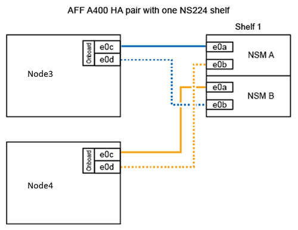

= 將 node2 轉換為磁碟機櫃、並連線至 node4
:allow-uri-read: 
:icons: font
:imagesdir: ../media/

[role="lead"]
將 AFF A250 node2 轉換為 NS224 磁碟機櫃、然後連線至 AFF A400 node4 、再將磁碟機從 node2 重新指派至 node4 。

.步驟
. 從 node2 拔下所有網路纜線。
. 從 AFF A250 機箱中移除 node2 。
. 將 NVMe 機櫃模組（ NSM ）插入 node2 的機櫃。
. 將 node4 100GbE 連接埠 e0c 連接至 NSM B 連接埠 e0a 、將 NSM 連接至 node4 。
+

. 將 25GbE 纜線從 node2 連接埠 e0c 和 e0d 連接至 node4 上的任何兩個 25GbE 板載連接埠（ e0e 、 e0f 、 e0g 或 e0h ）。
+

NOTE: 如果 node4 上沒有 25GbE 主機板內建連接埠、您可以使用 25GbE PCIe 介面卡進行連線。

. 如果 AFF A400 系統使用 FC 連接埠做為內建連接埠、請在移轉期間將 25Gb 乙太網路介面卡安裝到每個節點、以進行叢集連線：
+
.. 使用連接埠 e0a 和 e0b 、在 AFF A400 節點之間連接 HA 配對纜線。
.. 使用連接埠 e3a 和 e3b 在 AFF A400 節點之間連接叢集纜線。

